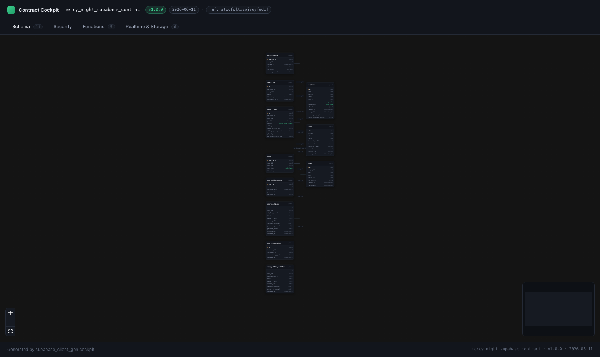
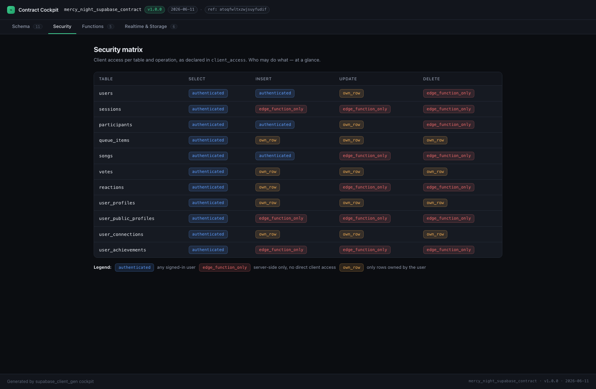
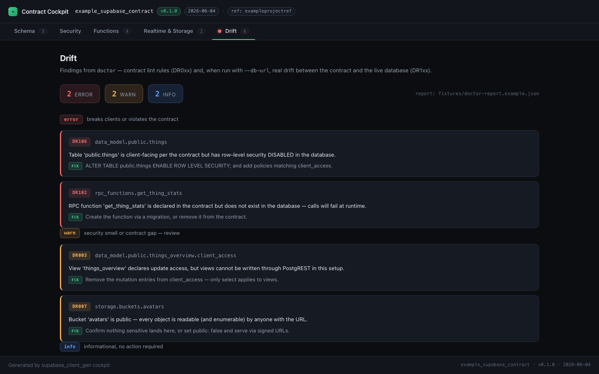

# Contract Cockpit

A statically generated visualization of a `supabase_client_gen` contract.
Point it at any `supabase.yaml` and get a browsable, committable, zero-server
site that makes the contract — the single source of truth of your Supabase
backend — visible at a glance.





> Screenshots show the MercyNight example contract (11 tables) — run the
> cockpit against your own contract to see your backend.

## Views

| View | What it shows |
| --- | --- |
| **Schema** | Interactive graph of all tables (React Flow): fields with types, primary keys, enum fields highlighted, views badged. Edges are references derived from `*_id` naming conventions. Click a table for the full detail panel (nullability, enums, client access). |
| **Security** | Table × operation matrix of `client_access` — who may select/insert/update/delete what, color-coded by access level, with legend. |
| **Functions** | Edge functions (method, description, request fields) and — if the contract declares them — Postgres RPC functions (args, returns). |
| **Realtime & Storage** | Tables in the realtime publication, declared realtime events, and storage buckets (visibility, MIME types, size limits). |
| **Drift** | Traffic light over a `doctor --json` report: error/warn/info counters (green check when in sync), findings grouped by severity with code, path, message, and fix. Tables with findings get a red/yellow status dot on the schema graph. Optional — without a report the tab shows how to generate one. |

## Quickstart

```bash
cd cockpit
npm install

# Build against the example contract (also the default):
CONTRACT=../example/supabase.yaml npm run build

# Or against your own project's contract:
CONTRACT=/path/to/your/supabase.yaml npm run build

# Local dev with hot reload:
CONTRACT=/path/to/your/supabase.yaml npm run dev

# Serve the built site:
npm run preview
```

The result is a fully static site in `dist/` — no server, no database
access, deterministic output. Host it anywhere (GitHub Pages, Cloudflare
Pages, an S3 bucket) or open it straight from a local web server.

## The `CONTRACT` variable

`CONTRACT` is resolved at build time, relative to the `cockpit/` directory
(absolute paths work too). The YAML is parsed once with `js-yaml` and baked
into the generated HTML. If the file is missing, the build fails with a clear
error. Default: `../example/supabase.yaml`.

## Drift workflow (`DOCTOR_REPORT`)

The **Drift** view visualizes the findings of the `doctor` command. Generate
a JSON report, then pass it to the build via `DOCTOR_REPORT` (resolved like
`CONTRACT`, relative to `cockpit/`):

```bash
# Contract-only lint (DR001–DR009):
dart run supabase_client_gen:doctor --contract supabase.yaml --json > report.json

# With live-database drift checks (DR101–DR106):
dart run supabase_client_gen:doctor --contract supabase.yaml \
  --db-url "$SUPABASE_DB_URL" --json > report.json

# Bake the report into the cockpit:
DOCTOR_REPORT=report.json CONTRACT=supabase.yaml npm run build
```

You get:

- a counter strip (errors / warnings / infos) — a green check reading
  *"Contract and database in sync"* when the report is empty,
- the findings grouped by severity, each with its code badge, contract path,
  message, and fix hint,
- red/yellow status dots on the schema-graph nodes of affected tables
  (mapped via the finding's `data_model.<schema>.<table>…` path).

`DOCTOR_REPORT` is optional: without it the Drift tab shows an empty state
with the exact command line to generate a report. A sample report for the
example contract lives at `fixtures/doctor-report.example.json`.

## How references are derived

The contract format does not (yet) declare foreign keys, so the schema graph
derives them from naming conventions:

- `session_id` (uuid) → table `sessions` (also tries exact name, `-es`,
  `-y` → `-ies` plurals)
- `added_by_user_id` (uuid) → falls back to the last token: `user` → `users`

Fields that do not resolve to a table in the contract simply get no edge.

## Stack

- [Astro](https://astro.build) — static output, zero client JS except the graph
- [React Flow](https://reactflow.dev) (`@xyflow/react`) — schema graph island
- [dagre](https://github.com/dagrejs/dagre) — deterministic auto-layout
- [js-yaml](https://github.com/nodeca/js-yaml) — build-time contract parsing
